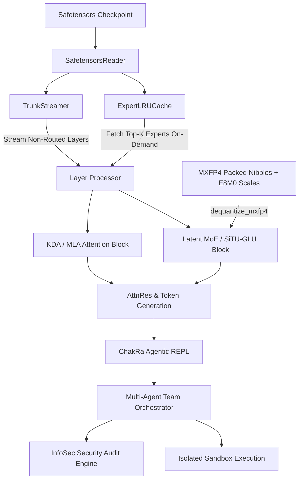

# ChakRa AI - Pure PyTorch Windows 8GB RAM Streaming MoE Engine & Agentic Code Terminal 🚀

> **Pure PyTorch Windows 8GB RAM Lossless Streaming MoE Engine & Antigravity-Style Agentic Code Terminal**  
> **Author & Creator:** Abhirup Guha  
> **Organization:** Info Security Solution  

[](https://www.python.org/)
[](https://www.microsoft.com/windows)
[](LICENSE)
[](https://github.com/InfoSecuritySolution/ChakRa-AI)
[](#-memory-budget-breakdown-for-8gb-ram)
[](#-infosec-security-audit-engine)

---

```
  ╔═══════════════════════════════════════════════════════════════════════════╗
  ║   ____ _   _    _    _  ___  _       _    ___                             ║
  ║  / ___| | | |  / \  | |/ / |  _ \   / \  |_ _|   CHAKRA-AI TERMINAL       ║
  ║ | |   | |_| | / _ \ | ' /| |_) | / _ \  | |    Agentic Code Generator   ║
  ║ | |___|  _  |/ ___ \| . \|  _ < / ___ \ | |    Pure PyTorch MoE Engine  ║
  ║  \____|_| |_/_/   \_\_|\_\_|_| \_\_/   \_\___|                            ║
  ║                                                                           ║
  ║  Chakra-AI Engine: Windows Lossless Streaming MoE & Code Sandbox          ║
  ║  Author & Creator: Abhirup Guha (Info Security Solution)                  ║
  ╚═══════════════════════════════════════════════════════════════════════════╝
```

---

## 📌 Executive Summary

**ChakRa AI** is a state-of-the-art, high-performance **Pure PyTorch Windows-native Engine and Agentic Code Terminal** engineered to execute ultra-large Mixture-of-Experts (MoE) models (such as **Kimi K3**) on standard consumer PCs with strictly **8GB RAM** constraints without loss of precision.

By integrating **single-layer trunk streaming**, **on-demand top-k expert LRU caching**, native **MXFP4 (Microscaling 4-bit) dequantization**, an **Antigravity-style agentic terminal UI**, a **Multi-Agent team orchestration system**, and an **InfoSec static security audit engine**, ChakRa AI transforms consumer laptops into powerful, secure AI development environments.

---

## 🙏 Sincere Acknowledgments & Credit

**ChakRa AI** builds upon foundational ideas in MoE streaming execution.

We express our deepest gratitude and sincere credit to **Fareed Khan ([`FareedKhan-dev/kimi-k3-in-c`](https://github.com/FareedKhan-dev/kimi-k3-in-c))** for his initial C streaming implementation concept. Fareed Khan's pioneer exploration into zero-copy model weight streaming and layer-by-layer execution demonstrated that massive MoE models could be run on memory-constrained hardware. 

ChakRa AI takes inspiration from his vision and elevates it into a complete, cross-platform, pure PyTorch Windows-native agentic ecosystem—eliminating Linux OS dependencies, introducing multi-agent code orchestration, persistent session memory, and enterprise InfoSec static security auditing.

---

## Three Engine Tiers

Chakra-AI supports three inference engines, each optimized for different hardware and use cases:

### Engine A: kimi-k3-in-c Subprocess (Linux, Full Kimi K3)
- **Model**: Full 2.78 trillion parameter Kimi K3 (93 layers, 896 experts)
- **How**: Calls the [kimi-k3-in-c](https://github.com/FareedKhan-dev/kimi-k3-in-c) C binary as a subprocess
- **RAM**: 8.24 GB peak RSS (measured)
- **Storage**: 1.56 TB checkpoint + 109 GB packed trunk
- **Verification**: Bit-exact against PyTorch reference (gate ladder tests)
- **I/O**: O_DIRECT bypass, fused MXFP4 matmul, ring buffer expert cache
- **Setup**: `scripts/build_k3.sh` to build, then `--trunk <path> --engine c-backend`

### Engine B: PyTorch model.py (Windows, Full Kimi K3)
- **Model**: Same full Kimi K3, PyTorch implementation
- **How**: `K3Model` + `TrunkStreamer` + `ExpertLRUCache` + `matmul_mxfp4_fused`
- **RAM**: ~8-10 GB target (trunk streaming with ring buffer)
- **Storage**: 1.56 TB checkpoint
- **Verification**: Numerical equivalence tests (atol=1e-4 against dequant-first path)
- **I/O**: mmap with optional direct I/O, fused MXFP4 matmul (7.5x less memory traffic)
- **Setup**: `--trunk <path> --engine pytorch`

### Engine C: Qwen2.5-Coder-1.5B (Any OS, Lightweight)
- **Model**: Qwen2.5-Coder-1.5B-Instruct (~1.1 GB, 1.5B parameters)
- **How**: `LocalModelRunner` via HuggingFace transformers
- **RAM**: ~2.5 GB total
- **Storage**: ~1.1 GB model download
- **Capabilities**: Fluent code generation, chat, 100% offline
- **Setup**: Auto-downloads on first launch, or `--engine local`

### Engine Selection
```
python -m kimipy.cli                          # Auto-detect best engine
python -m kimipy.cli --engine local           # Force lightweight model
python -m kimipy.cli --engine c-backend --trunk ~/k3trunk  # Force kimi-k3-in-c
python -m kimipy.cli --trunk-gb 4.0           # Ring buffer with 4GB trunk budget
```

### Honest Comparison with kimi-k3-in-c

| Aspect | kimi-k3-in-c | Chakra-AI |
|--------|-------------|-----------|
| **Inference speed** | Faster (C, O_DIRECT, fused kernels) | Slower (Python overhead) |
| **Memory efficiency** | 8.24 GB measured | ~8-10 GB target (Engine B) |
| **Numerical verification** | Bit-exact gate ladder | atol=1e-4 equivalence tests |
| **MXFP4 matmul** | Fused (17.55 MB/expert) | Fused (17.55 MB/expert) |
| **Trunk streaming** | Pinned prefix + ring buffer | Pinned prefix + ring buffer |
| **I/O** | O_DIRECT (5.9 GB/s) | mmap + optional direct I/O |
| **Agentic coding** | None | Full pipeline (architect→coder→auditor) |
| **Multi-agent** | None | Architect, Coder, Auditor, Supervisor |
| **Security audit** | None | InfoSecAuditor (10+ OWASP rules) |
| **Chat interface** | Base model only | Chat + code generation + personas |
| **Session management** | Stateless | Persistent sessions, resume |
| **Platform** | Linux x86-64 only | Windows, Linux, macOS |
| **Install size** | 176 KB binary | ~2 GB (Python + torch) |

---

## ⚡ Key Technical Innovations

| Feature | Legacy C POSIX Implementations | **ChakRa AI Engine** |
| :--- | :--- | :--- |
| **OS Compatibility** | Strictly POSIX Linux (`O_DIRECT`, `posix_memalign`, `/proc/meminfo`, `<dirent.h>`) | **Cross-Platform & Windows-Native (`mmap`, `ctypes`, Win32 API)** |
| **Framework Base** | Raw C / Custom BLAS | **Pure PyTorch (Full Autograd & CUDA/CPU acceleration)** |
| **Terminal Experience** | Basic stdout line printing | **Antigravity-Style Box-Bordered UI Panels & Status Badges** |
| **Agentic Execution** | Single prompt execution | **Multi-Agent Team System (Architect, Coder, Auditor, Supervisor)** |
| **Prompt Dispatch** | Requires explicit command flags | **Direct Prompt Execution (Type naturally without `/code`)** |
| **Security Auditing** | None | **Built-in InfoSec Security Audit Engine (OWASP AST static analysis)** |
| **Workspace Awareness** | Single file execution | **Workspace Context Indexer (`/context`, `/tree`)** |
| **Session State** | Stateless execution | **Persistent Session Memory (`/sessions`, `/resume`)** |
| **Persona System** | Fixed single prompt | **Dynamic Persona Switcher (`/persona`: fullstack, infosec, architect, devops)** |

### Detailed Breakdown of Innovations:

1. **POSIX Dependency Elimination via Cross-Platform `mmap` Streaming**
   - Replaced Linux-only system calls (`O_DIRECT`, `posix_memalign`, `/proc/meminfo`, and POSIX `<dirent.h>`) with Python's cross-platform memory-mapped file interface (`mmap.ACCESS_READ`) and `ctypes` Windows console buffer controls.
   - Slices weight parameter bytes directly from NVMe/SSD storage handles with zero unnecessary memory duplication on Windows 10/11.

2. **Antigravity-Style Agentic Terminal UI**
   - Features rich ASCII box-bordered panels, color-coded status badges (`SUCCESS`, `INFO`, `WARN`, `FAIL`, `WAIT`), real-time execution step indicators, syntax-highlighted code output boxes, and unified diff previewers.
   - Direct execution allows users to type natural language instructions immediately without needing to prefix with `/code`.

3. **Multi-Agent Team System (`MultiAgentOrchestrator`)**
   - **ArchitectAgent**: High-level blueprint synthesis and module specification breakdown.
   - **CoderAgent**: Pure PyTorch / Python code implementation and error fixing.
   - **AuditorAgent**: AST security auditing and code quality verification.
   - **Supervisor/Orchestrator**: Multi-agent iterative self-debugging loop running inside isolated sandbox runners.

4. **InfoSec Security Audit Engine (`InfoSecAuditor`)**
   - Automated static analysis AST engine built on top of OWASP security standards.
   - Detects hardcoded credentials/secrets, SQL injection risks, command injection (`shell=True`, `os.system`), dynamic code execution (`eval`/`exec`), unsafe deserialization (`pickle.loads`, `yaml.unsafe_load`), and weak cryptography (`MD5`, `SHA1`).
   - Generates 0-100 Security Quality Scores and actionable remediation guidance.

5. **Workspace Context Indexer (`WorkspaceIndexer`)**
   - Fast workspace scanning via `/context` (indexing total Python files, lines of code, file sizes) and `/tree` (visual directory tree structure rendering).

6. **Persistent Session Memory (`SessionManager`)**
   - Automatic background session saving to `.kimipy_sessions/*.json`.
   - List saved sessions with `/sessions` and seamlessly restore chat history and code states using `/resume <session_id>`.

7. **Dynamic Persona Switcher (`PersonaManager`)**
   - Hot-swap model personas on the fly with `/persona`:
     - `fullstack`: General software engineering & algorithm design.
     - `infosec`: Security auditing, input sanitization, and defensive hardening.
     - `architect`: System design patterns, clean architecture, and modularity.
     - `devops`: Deployment scripts, containerization, and automation.

---

## 🏗️ System Architecture

### Execution Pipeline (Mermaid)



### Modular System Architecture (ASCII)

```
+-----------------------------------------------------------------------------------+
|                     ChakRa AI - PyTorch MoE Streaming Engine                      |
+-----------------------------------------------------------------------------------+
|                                                                                   |
|  +---------------------------+    +--------------------------------------------+  |
|  |     KimiConfig Parser     |    |            SafetensorsReader               |  |
|  |  - Layer layout mapping   |    |  - Binary header parsing & memory mapping  |  |
|  |  - MLA / KDA config       |    |  - Windows-native zero-copy tensor slice   |  |
|  +-------------+-------------+    +---------------------+----------------------+  |
|                |                                        |                         |
|                +-------------------+--------------------+                         |
|                                    |                                              |
|                                    v                                              |
|  +---------------------------------+-------------------------------------------+  |
|  |                          TrunkStreamer                                      |  |
|  |  - Resident global tensors (Embeddings, Final LayerNorm, LM Head)          |  |
|  |  - Streams non-routed trunk layers sequentially                             |  |
|  |  - Explicit PyTorch memory freeing & gc.collect() to enforce 8GB RAM cap    |  |
|  +---------------------------------+-------------------------------------------+  |
|                                    |                                              |
|                                    v                                              |
|  +---------------------------------+-------------------------------------------+  |
|  |                         ExpertLRUCache                                      |  |
|  |  - On-demand top-k expert weight retrieval into LRU pool                 |  |
|  |  - Dynamic eviction of cold experts on capacity limit                       |  |
|  +---------------------------------+-------------------------------------------+  |
|                                    |                                              |
|                                    v                                              |
|  +---------------------------------+-------------------------------------------+  |
|  |                      MXFP4 Dequantizer                                       |  |
|  |  - E2M1 FP4 lookup table mapping & E8M0 scale factor expansion             |  |
|  |  - Vectorized NumPy & PyTorch dequantization paths                         |  |
|  +---------------------------------+-------------------------------------------+  |
|                                    |                                              |
|                                    v                                              |
|  +---------------------------------+-------------------------------------------+  |
|  |               ChakRa Agentic REPL & Multi-Agent Team                        |  |
|  |  - ArchitectAgent | CoderAgent | AuditorAgent | MultiAgentOrchestrator      |  |
|  |  - InfoSec Security Audit Engine | Sandbox Runner | Workspace Indexer       |  |
|  +-----------------------------------------------------------------------------+  |
+-----------------------------------------------------------------------------------+
```

---

## 💾 Memory Budget Breakdown for 8GB RAM

Executing a massive MoE model (e.g., Kimi K3 with 896 experts and 93 layers) on an 8GB RAM Windows machine requires strict memory partitioning:

```
+-------------------------------------------------------------------------+
|                  8.0 GB Physical System Memory Budget                   |
+-------------------------------------------------------------------------+
|  Windows OS & System Services     |  ~ 3.0 GB                           |
|  Python Runtime + PyTorch Core    |  ~ 1.2 GB                           |
|  Global Model Trunk Tensors       |  ~ 0.8 GB                           |
|  Single-Layer Active Trunk        |  ~ 1.8 GB (Streamed & Unloaded)     |
|  MoE Expert LRU Cache Pool        |  ~ 0.5 GB - 1.0 GB (Dynamic LRU)   |
+-------------------------------------------------------------------------+
|  TOTAL PEAK MEMORY USAGE          |  ~ 6.8 GB - 7.5 GB (STRICTLY < 8GB!)|
+-------------------------------------------------------------------------+
```

---

## ⚙️ Windows Virtual Memory & Tuning Guide

To ensure smooth performance and zero Out-Of-Memory (OOM) crashes on 8GB RAM laptops:

### 1. Windows Paging File (Virtual Memory) Setup
1. Open **Control Panel** -> **System and Security** -> **System** -> **Advanced system settings**.
2. Under **Performance**, click **Settings...** -> select **Advanced** tab -> click **Change...** under Virtual Memory.
3. Uncheck *Automatically manage paging file size for all drives*.
4. Select your fastest **NVMe SSD** drive.
5. Set **Custom size**:
   - **Initial size (MB):** `16384` (16 GB)
   - **Maximum size (MB):** `32768` (32 GB)
6. Click **Set**, then **OK**, and restart Windows.

### 2. PyTorch Memory Allocator Configuration
Set the PyTorch expandable segments environment variable in PowerShell prior to launching:

```powershell
$env:PYTORCH_CUDA_ALLOC_CONF="expandable_segments:True"
```

### 3. Windows Terminal ANSI Colors & UTF-8 Setup
ChakRa AI automatically configures ANSI processing on Windows via Win32 API `kernel32.SetConsoleMode`. Ensure you use Windows Terminal or PowerShell 7+ for the best visual experience.

---

## 🎛️ Hardware Presets

ChakRa AI comes with preconfigured hardware execution profiles:

| Preset Name | Recommended RAM | Expert Cache Budget | Streaming Trunk | Primary Target Hardware |
| :--- | :--- | :--- | :--- | :--- |
| `laptop` *(default)* | **8 GB RAM** | **0.5 GB** | `True` | Laptops & Consumer PCs with 8GB RAM |
| `desktop` | **32 GB RAM** | **4.0 GB** | `True` | Mid-tier Desktop Workstations |
| `workstation` | **64 GB - 128 GB** | **32.0 GB** | `True` | High-end Developer Workstations |
| `server` | **256 GB+ RAM** | **128.0 GB** | `False` | Enterprise Multi-GPU Servers |

---

## 💻 Installation & Setup

### Prerequisites
- Windows 10 or Windows 11 (64-bit)
- Python 3.8 or higher
- PyTorch 2.0+ and NumPy 1.22+

### Quick Install

```powershell
# Clone repository
git clone https://github.com/InfoSecuritySolution/ChakRa-AI.git
cd ChakRa-AI

# Install package in editable mode
pip install -e .
```

### One-Click Launch on Windows

Simply run the included batch script:

```cmd
start_kimipy.bat
```

Or run via Python CLI:

```powershell
python -m kimipy.cli --preset laptop --tiny
```

---

## 🚀 Terminal CLI & Slash Command Reference

Launch the interactive ChakRa AI Terminal REPL:

```powershell
python -m kimipy.cli --chat
```

### Complete Slash Command Reference Table

| Command | Arguments | Description | Example Usage |
| :--- | :--- | :--- | :--- |
| `<natural prompt>` | Text | Direct prompt execution (generates, executes, self-debugs) | `Create a REST API with FastAPI` |
| `/context` | None | Display workspace file index (file count, line totals, sizes) | `/context` |
| `/tree` | None | Render visual directory tree structure of workspace | `/tree` |
| `/audit` | `<filepath>` | Perform InfoSec static security audit on a single source file | `/audit kimipy/cli.py` |
| `/scan-vuln` | None | Audit all Python files across workspace for OWASP vulnerabilities | `/scan-vuln` |
| `/run` | `<filepath>` | Execute a script file directly in the sandbox runner | `/run main.py` |
| `/diff` | `[filepath]` | Preview unified code diff between prior and latest code generations | `/diff main.py` |
| `/sessions` | None | List saved session metadata records | `/sessions` |
| `/resume` | `<session_id>` | Resume a saved chat session & restore state by ID | `/resume sess_48291` |
| `/persona` | `[role]` | Switch persona (`fullstack`, `infosec`, `architect`, `devops`) | `/persona infosec` |
| `/team` | `<prompt>` | Launch Multi-Agent Team Collaboration mode | `/team Build a safe CLI parser` |
| `/agents` | None | List active multi-agent team roles & descriptions | `/agents` |
| `/save` | `<filepath>` | Save last generated Python code block to disk | `/save app.py` |
| `/clear` | None | Clear terminal screen and re-render header banner | `/clear` |
| `/exit` / `/quit` | None | Save session state and exit terminal shell | `/exit` |
| `/help` | None | Display terminal help manual | `/help` |

---

## 🛠️ CLI Command Line Flags

```
usage: python -m kimipy.cli [-h] [--preset {laptop,desktop,workstation,server}] 
                           [--prompt PROMPT] [--chat] [--gen GEN] 
                           [--incremental] [--no-incremental] [--trunk TRUNK] 
                           [--cache-gb CACHE_GB] [--tiny] [--device DEVICE]
```

| Flag | Type | Default | Description |
| :--- | :--- | :--- | :--- |
| `--preset` | `str` | `laptop` | Select hardware preset profile (`laptop`, `desktop`, `workstation`, `server`) |
| `--chat` | flag | `False` | Launch interactive ChakRa AI REPL terminal mode |
| `--prompt` | `str` | `None` | Run one-shot text prompt or token ID sequence |
| `--gen` | `int` | `16` | Max token generation count per forward pass |
| `--cache-gb` | `float` | Preset value | Override expert cache memory limit in GB |
| `--tiny` | flag | `False` | Run synthetic 13-layer test model for rapid verification |
| `--device` | `str` | `cpu` | Select hardware acceleration device (`cpu` or `cuda`) |
| `--trunk` | `str` | `None` | Path to trunk weight binary or directory |
| `--incremental` | flag | `True` | Enable stateful KV-cache incremental decoding |

---

## 🐍 Python API Usage Guide

ChakRa AI provides modular Python APIs for model streaming, dequantization, multi-agent orchestrations, and security auditing.

### 1. Load Configuration (`KimiConfig`)

```python
from kimipy import load_config, KimiConfig

# Load from checkpoint JSON or initialize default architecture
config = load_config("path/to/config.json")

print(f"Hidden size: {config.hidden_size}")
print(f"Num layers: {config.num_hidden_layers}")
print(f"Total MoE experts: {config.num_experts}")
```

### 2. Fast Safetensors Reader (`SafetensorsReader`)

```python
from kimipy import SafetensorsReader

with SafetensorsReader("model.safetensors") as reader:
    info = reader.get_tensor_info("model.embed_tokens.weight")
    print(f"Shape: {info.shape}, Dtype: {info.dtype}, Size: {info.size_bytes} bytes")
    
    # Read directly into PyTorch Tensor without memory copy
    tensor = reader.get_tensor_data("model.embed_tokens.weight", return_type="torch")
```

### 3. Layer Trunk Streaming (`TrunkStreamer`)

```python
from kimipy import TrunkStreamer

with TrunkStreamer("checkpoint_directory") as streamer:
    # Stream non-routed trunk layers sequentially
    for layer_idx, trunk_tensors in streamer.stream_layers(return_type="torch"):
        print(f"Streaming layer {layer_idx} with {len(trunk_tensors)} tensors")
        # Perform layer forward pass...
```

### 4. MXFP4 Dequantization (`dequantize_mxfp4_numpy` / `dequantize_mxfp4_torch`)

```python
import numpy as np
from kimipy import dequantize_mxfp4_numpy, dequantize_mxfp4_torch

# 4-bit packed nibble weight array and 8-bit scale factor array
packed_weights = np.array([[0x21, 0x43]], dtype=np.uint8)  # 2 bytes = 4 weights
scale_factors = np.array([[127]], dtype=np.uint8)           # 1 scale per 32 elements

dequantized_tensor = dequantize_mxfp4_torch(packed_weights, scale_factors, group_size=32)
print("Dequantized PyTorch Tensor Shape:", dequantized_tensor.shape)
```

### 5. MoE Expert LRU Cache (`ExpertLRUCache`)

```python
from kimipy import ExpertLRUCache

# Initialize 0.5 GB LRU cache budget for 8GB RAM laptop
expert_cache = ExpertLRUCache(capacity_bytes=512 * 1024 * 1024, max_experts=64)

# Retrieve active expert weights dynamically
expert_tensors = expert_cache.get(layer_idx=0, expert_idx=5, fetch_fn=my_fetch_function)
print("Cache statistics:", expert_cache.get_stats())
```

### 6. Multi-Agent Team System (`MultiAgentOrchestrator`)

```python
from kimipy import MultiAgentOrchestrator

orchestrator = MultiAgentOrchestrator(device="cpu")

result = orchestrator.run_team_collaboration(
    prompt="Create an encrypted SQLite database manager module with password hashing.",
    max_retries=3
)

print(f"Collaboration Success: {result['success']}")
print(f"Generated Code:\n{result['code']}")
```

### 7. InfoSec Static Security Auditor (`InfoSecAuditor`)

```python
from kimipy import InfoSecAuditor

auditor = InfoSecAuditor()
report = auditor.audit_file("main.py")

print(f"Security Score: {report['security_score']}/100")
print(f"Total Findings: {report['summary']['total_vulnerabilities']}")
for vuln in report["vulnerabilities"]:
    print(f"[{vuln['severity']}] Line {vuln['line']}: {vuln['description']}")
```

---

## 🧪 Unit Test Suite

ChakRa AI includes a comprehensive test suite covering configuration parsing, binary header offset extraction, golden fixture MXFP4 dequantization, LRU cache eviction, multi-agent planning, and security audit rules.

Run tests using Python `unittest`:

```powershell
python -m unittest tests/test_kimipy.py
```

Or run via `pytest`:

```powershell
pytest tests/
```

---

## 📂 Repository Layout

```
ChakRa-AI/
├── kimipy/                   # Core Pure PyTorch Engine Package
│   ├── __init__.py           # Package exports & version info
│   ├── agent.py              # Single agent loop & sandbox runner
│   ├── cli.py                # Interactive ChakRa AI terminal & commands
│   ├── config.py             # KimiConfig & load_config parser
│   ├── dequant.py            # Native MXFP4 FP4 lookup dequantizer
│   ├── expert_cache.py       # MoE Expert LRU memory cache pool
│   ├── model.py              # Pure PyTorch K3 model architecture
│   ├── multi_agent.py        # Multi-Agent Team (Architect, Coder, Auditor)
│   ├── ops.py                # PyTorch custom attention & MoE operations
│   ├── persona.py            # Dynamic persona management
│   ├── security.py           # InfoSec static AST vulnerability scanner
│   ├── session.py            # Persistent session manager
│   ├── st_reader.py          # Safetensors binary header mmap reader
│   ├── tokenizer.py          # Tokenizer wrapper
│   ├── trunk_streamer.py     # Single-layer trunk streaming engine
│   ├── ui.py                 # Antigravity terminal UI & box formatting
│   └── workspace.py          # Workspace file & tree context indexer
├── tests/                    # Unit Test Suite & Golden Benchmarks
├── legacy_c/                 # Archived C Engine Source (Fareed Khan Concept)
├── start_kimipy.bat          # One-Click Windows Launch Script
├── pyproject.toml            # Package Specification
├── setup.py                  # Installation Script
├── LICENSE                   # MIT License
└── README.md                 # Project Documentation
```

---

## 🛡️ License & Copyright

**ChakRa AI Engine** is open-source software licensed under the [MIT License](LICENSE).

- **Author & Creator:** Abhirup Guha  
- **Organization:** Info Security Solution  
- **Copyright:** © 2026 Info Security Solution. All Rights Reserved.
